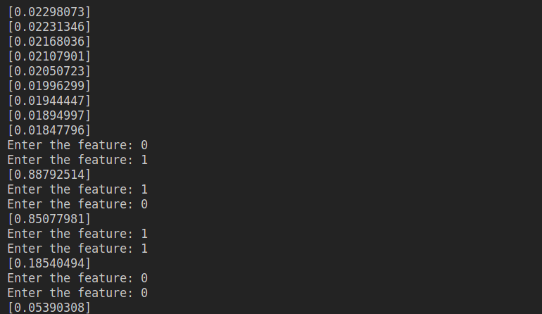

# AI-Tutorial-Multilayer-Perceptron-Numpy-Batch-Version

This is a 3 layer MLP Neural Network using only Numpy that can help us understand the principle of the neural network.The problem we used is XOR problem.This is the version that processes the data by full batch which is more easier than the older version.

## Run

```code
python mlp.py
```

## Output Example



## MSE Plot

